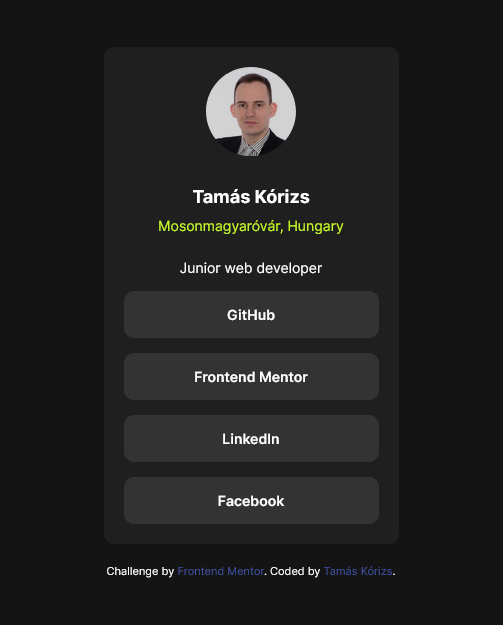

# Frontend Mentor - Social links profile solution

This is a solution to the [Social links profile challenge on Frontend Mentor](https://www.frontendmentor.io/challenges/social-links-profile-UG32l9m6dQ). Frontend Mentor challenges help you improve your coding skills by building realistic projects.

## Table of contents

- [Overview](#overview)
  - [The challenge](#the-challenge)
  - [Screenshot](#screenshot)
  - [Links](#links)
- [My process](#my-process)
  - [Built with](#built-with)
  - [What I learned](#what-i-learned)
  - [Continued development](#continued-development)
  - [Useful resources](#useful-resources)
- [Author](#author)
- [Acknowledgments](#acknowledgments)

**Note: Delete this note and update the table of contents based on what sections you keep.**

## Overview

### The challenge

Users should be able to:

- See hover and focus states for all interactive elements on the page

### Screenshot



### Links

- Solution URL: [Add solution URL here](https://your-solution-url.com)

## My process

### Built with

- Semantic HTML5 markup
- CSS custom properties
- Flexbox
- Mobile-first workflow

### What I learned

I have exercised how to make an interactive menu with help of Flexbox

```html
<ul>
        <li><a href="https://github.com/korizst">GitHub</a></li>
        <li><a href="https://www.frontendmentor.io/profile/korizst">Frontend Mentor</a></li>
        <li><a href="https://www.linkedin.com/in/tam%C3%A1s-k%C3%B3rizs-007746188/">LinkedIn</a></li>
        <li><a href="https://www.facebook.com/tamas.korizs.5">Facebook</a></li>
      </ul>
```

```css
li {
  list-style-type: none;
  margin: 15px 0;
}

li:last-child {
  margin: 0;
}

a {
  text-decoration: none;
}

li a {
  display: block;
  color: white;
  background-color: hsl(0, 0%, 20%);
  text-align: center;
  width: 100%;
  padding: 15px;
  font-weight: 600;
  border-radius: 10px;
}

li a:hover {
  background-color: hsl(75, 94%, 57%);
  color: hsl(0, 0%, 8%);
}
```

### Continued development

The next project similar to this one I try to solve with CSS Grid., because I'm not familiar with it.

### Useful resources

- CSS-Tricks - This helped me for implementing this project with Flexbox.

## Author

- Name - Tamás Kórizs
- Frontend Mentor - [@korizst](https://www.frontendmentor.io/profile/yourusername "korizst")
